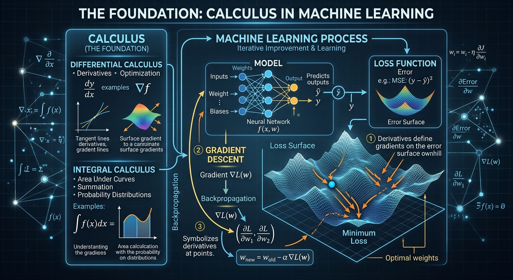
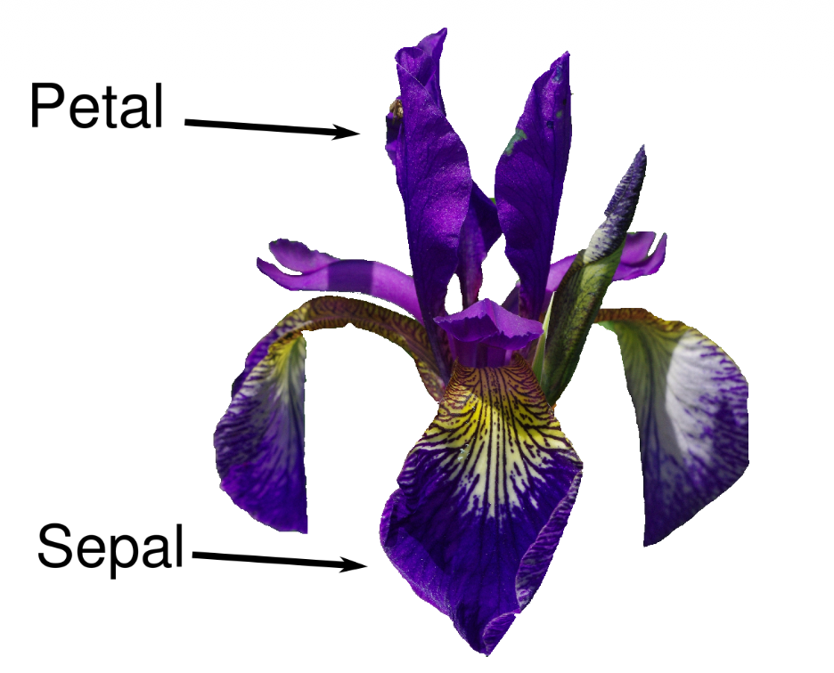
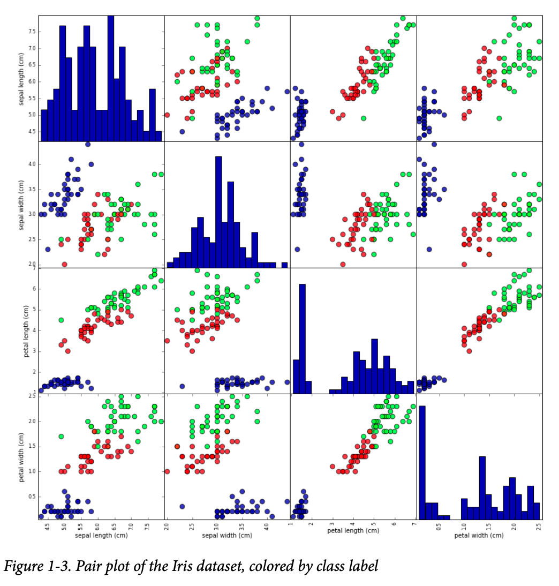
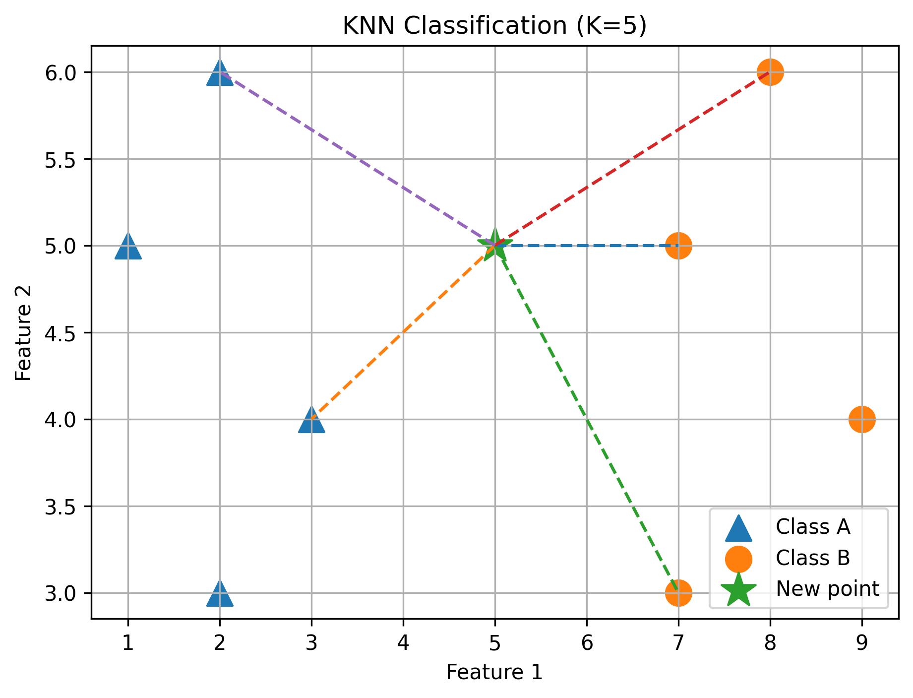
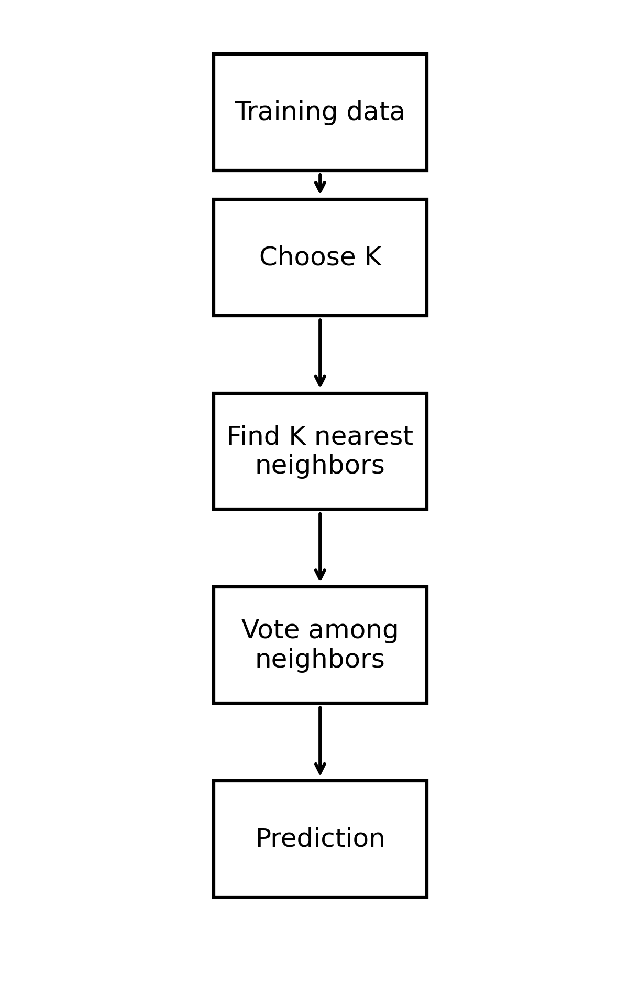

<!-- _class: lead -->

# Chapter 1
## Introduction

Why machine learning, the Python stack,
and building your first classifier

---

## Learning Objectives

By the end of this chapter you can:

- Explain what machine learning is and **when** to use it
- Contrast **handcoded rules** with learning from data
- Distinguish **supervised** from **unsupervised** learning
- Describe data as **samples × features**
- Set up the Python stack and build a first model end-to-end

---

## What Is Machine Learning?

- **Extracting knowledge from data** — at the intersection of statistics, AI, and computer science
- Also called *predictive analytics* or *statistical learning*
- Already everywhere: movie & product recommendations, personalized radio, tagging friends in photos
- A site like Amazon or Netflix runs **many** ML models at once
- Also drives science: understanding stars, DNA sequencing, cancer treatment


---

<!-- _footer:  '' -->



---

## Why Machine Learning?

Early "intelligent" apps used **handcoded `if/else` rules**.

- Example: a spam filter with a blacklist of words
- Works when a human understands the process well and can write the rules

But manually crafting rules has **two major drawbacks**:

1. The logic is **specific to one domain/task** — a small change may mean rewriting everything
2. It requires **deep understanding** of how a human makes the decision

---

## When Handcoded Rules Fail

**Face detection in images:**

- Every smartphone can now find faces — but this was *unsolved until ~2001*
- A computer "sees" pixels; that is nothing like how humans perceive a face
- No human can write rules that describe a face in terms of pixel values

> With machine learning, showing a program **a large collection of face images** is enough for it to learn what characteristics identify a face.

---

## Problems ML Can Solve: Supervised Learning

- The most successful algorithms **automate decisions by generalizing from known examples**
- The user supplies **input → desired output** pairs; the algorithm learns to produce outputs for **new, unseen** inputs
- A "teacher" supervises by providing the correct answer for each example
- Well understood, and performance is **easy to measure**

> If you can frame it as supervised learning **and** collect input/output data, ML will likely solve it.

---

## Supervised Learning — Examples

| Task | Input | Output |
|------|-------|--------|
| Read zip codes | scan of handwriting | the digits |
| Diagnose a tumor | medical image | benign / malignant |
| Detect card fraud | transaction record | fraudulent? |

⚠️ The **data-collection cost differs wildly**: scanning envelopes is cheap;
medical images need experts & raise ethics/privacy concerns; fraud labels
arrive "for free" as customers report fraud.

---

## Unsupervised Learning

- Only the **input** data is known — **no known outputs**
- The algorithm finds structure on its own
- Many successful uses, but usually **harder to understand and evaluate**

Examples:

- **Topic discovery** in a set of blog posts (unknown how many topics)
- **Customer segmentation** into similar groups (groups not known in advance)
- **Anomaly detection** — abnormal website access with no examples of "abnormal"

---

## Represent Data as a Table

Both supervised & unsupervised learning need a computer-readable representation.

- Think of data as a **table**
- Each **row** = one **sample** (data point): an email, a customer, a transaction
- Each **column** = one **feature**: a property describing the sample

*"Shape"* of data in scikit-learn = **(n_samples, n_features)**.

---

## Good Features Matter

- Building a good representation is **feature extraction / feature engineering** (Chapter 4)
- No algorithm can predict from information the data doesn't contain

> If a patient's only feature is their **last name**, no algorithm can predict their gender.
> Add their **first name** and you'll have much better luck.

---

## Knowing Your Task and Your Data

Possibly the **most important** part of the process. Before modeling, ask:

- What question am I answering? Can the data I have answer it?
- What is the **best way to phrase** it as an ML problem?
- Have I collected **enough**, and the **right**, data?
- What **features** will I extract — will they enable good predictions?
- How will I **measure success**?
- How will the solution interact with the rest of the product?

> Algorithms are just one part of a bigger process — keep the big picture in mind.

---

## Why Python?

- The **lingua franca** for data science
- Combines general-purpose programming power with the ease of domain-specific tools (like MATLAB or R)
- Rich libraries for data loading, visualization, statistics, NLP, image processing
- **Interactive** workflow (terminals, Jupyter) suits the iterative nature of ML
- Also builds GUIs, web services, and integrates with existing systems

---

## scikit-learn

- **Open source** — free to use, inspect, and distribute
- Actively developed, large community, state-of-the-art algorithms
- The most prominent Python ML library — used across **industry and academia**
- Works hand-in-hand with the wider scientific Python stack
- Excellent **user guide** and API documentation

Install with the whole stack:

```bash
pip install numpy scipy matplotlib ipython scikit-learn pandas
```

---

## Essential Libraries and Tools

| Tool | Role |
|------|------|
| **Jupyter Notebook** | interactive, browser-based coding (code + text + plots) |
| **NumPy** | `ndarray`, linear algebra, FFT, random numbers |
| **SciPy** | scientific routines; **sparse matrices** for mostly-zero data |
| **matplotlib** | publication-quality plots (line, histogram, scatter) |
| **pandas** | `DataFrame` tables; ingest CSV/SQL/Excel |
| **mglearn** | book's helper utilities for quick plots/datasets |

---

## NumPy Arrays & SciPy Sparse Matrices

The `ndarray` is scikit-learn's fundamental data structure.

```python
import numpy as np
x = np.array([[1, 2, 3], [4, 5, 6]])     # 2D array

from scipy import sparse
eye = np.eye(4)                           # 4x4 identity
sparse_matrix = sparse.csr_matrix(eye)    # store only nonzeros
```

**Sparse matrices** store only nonzero entries — essential when a dense
version wouldn't fit in memory (common with text data).


---

### Dense NumPy matrix

```python
A = np.array([
    [1, 2, 3, 4],
    [5, 6, 7, 8],
    [9, 10, 11, 12]
])
```

Memory (row-major / C-order):
```
┌────┬────┬────┬────┐
│  1 │  2 │  3 │  4 │  → contiguous memory
├────┼────┼────┼────┤
│  5 │  6 │  7 │  8 │
├────┼────┼────┼────┤
│  9 │ 10 │ 11 │ 12 │
└────┴────┴────┴────┘
```
```
[1][2][3][4][5][6][7][8][9][10][11][12]
```
---

### Sparse matrix

```
B =
┌────┬────┬────┬────┬────┬────┐
│  0 │  0 │  7 │  0 │  0 │  0 │
├────┼────┼────┼────┼────┼────┤
│  0 │  0 │  0 │  0 │  2 │  0 │
├────┼────┼────┼────┼────┼────┤
│  5 │  0 │  0 │  0 │  0 │  0 │
└────┴────┴────┴────┴────┴────┘
```

Instead of storing every element:

values:  [7, 2, 5]

row:     [0, 1, 2]

column:  [2, 4, 0]

Only non-zero values are stored.


---


| Aspect | Dense NumPy array | Sparse matrix |
|---|---|---|
| Storage | Stores every element | Mostly stores non-zero elements |
| Best for | Dense data | Mostly-zero data |
| Memory | `O(rows × cols)` | Roughly `O(nonzeros)` |
| Access | Very fast/direct | More indirect |
| Typical representation | `numpy.ndarray` | SciPy sparse matrix |


---

<!-- _class: lead -->

## Part 2

# A First Application:
# Classifying Iris Species

---

## The Iris Problem

<div class="columns-wide-left">
<div class="column">

A hobby botanist wants to identify iris flowers she finds.

- **Features:** length & width of **petals** and **sepals** (cm) → 4 numbers
- **Target:** species — *setosa, versicolor,* or *virginica*
- She has measurements already labeled by an expert

Because we have labeled examples and predict one of several options,
this is **supervised, multiclass classification**.
Possible outputs are **classes**; the answer for one flower is its **label**.

</div>
<div class="column">

</div>
</div>

---

## Meet the Data

The Iris dataset is a classic, built into scikit-learn.

```python
from sklearn.datasets import load_iris
iris_dataset = load_iris()

iris_dataset.keys()
# ['target_names', 'feature_names', 'DESCR', 'data', 'target']
```

Returned as a `Bunch` object — like a dictionary of keys and values.

---

## Inspecting the Data

```python
iris_dataset['data'].shape        # (150, 4) → 150 samples, 4 features
iris_dataset['target_names']      # ['setosa' 'versicolor' 'virginica']
iris_dataset['feature_names']     # sepal/petal length & width (cm)
iris_dataset['target'][:5]        # [0 0 0 0 0]  encoded 0,1,2
```

- **`data`** — numeric measurements (NumPy array), one row per flower
- **`target`** — species per flower, encoded as integers **0 / 1 / 2**

---

## Measuring Success: Train / Test Split

We can't judge a model on the data it learned from — it could just **memorize**.
To measure **generalization**, hold out unseen data.

```python
from sklearn.model_selection import train_test_split
X_train, X_test, y_train, y_test = train_test_split(
    iris_dataset['data'], iris_dataset['target'], random_state=0)
```

- Convention: capital **`X`** (2D data matrix), lowercase **`y`** (1D labels)
- Default split is **75% train / 25% test**; `random_state` makes it reproducible

---

## First, Look at Your Data

Inspect before modeling — spot oddities, and check the task is even solvable.

- A **pair plot** shows every pair of features, colored by class
- For only 4 features this is very informative

```python
import pandas as pd
iris_df = pd.DataFrame(X_train, columns=iris_dataset.feature_names)
pd.plotting.scatter_matrix(iris_df, c=y_train, figsize=(15, 15),
                           marker='o', hist_kwds={'bins': 20}, s=60, alpha=.8)
```

The three species separate well → a model should learn to tell them apart.

---



---

## Build Your First Model: k-Nearest Neighbors

Every scikit-learn algorithm is an **`Estimator`** class.
k-NN prediction = the class of the **closest** training point(s).

```python
from sklearn.neighbors import KNeighborsClassifier

knn = KNeighborsClassifier(n_neighbors=1)   # set parameters
knn.fit(X_train, y_train)                    # build the model
```

`fit` just stores the training data here. The pattern you'll reuse everywhere:
**`fit` → `predict` → `score`**.

---

## Making Predictions

Predict the species of a new flower (sepal 5×2.9, petal 1×0.2 cm):

```python
import numpy as np
X_new = np.array([[5, 2.9, 1, 0.2]])   # must be 2D: (1 sample, 4 features)

prediction = knn.predict(X_new)
iris_dataset['target_names'][prediction]   # -> ['setosa']
```

The model predicts **setosa** — but can we trust it?
We don't know this flower's true species, so we turn to the test set.

---

## Evaluating the Model

Compare predictions on the **test set** against the known labels.

```python
y_pred = knn.predict(X_test)
np.mean(y_pred == y_test)      # 0.97
knn.score(X_test, y_test)      # 0.97  (same, convenient)
```

**~97% accuracy** — the model correctly identifies about 97 of every 100
unseen irises. High enough that our botanist could trust it.

---

## Chapter Summary

- ML **extracts knowledge from data** instead of relying on handcoded rules
- **Supervised** learns from labeled input/output pairs; **unsupervised** finds structure with no labels
- Data is **samples × features**; good features are decisive
- Split into **train/test** to measure real **generalization**
- Every scikit-learn model follows **`fit` / `predict` / `score`**
- The Iris data = a data array **X** plus a target array **y**

---

## Theory of K-NN

 k-NN is a **non-parametric** model: it doesn't assume a particular shape for the decision boundary



---

### How KNN works (step by step)

1. Store training data

   * KNN does not build a mathematical model.
   * It simply remembers all labeled examples.

2. Choose K (number of neighbors)

    * Suppose we choose: k = 5
    * Look at the 5 closest points around the new point:
      * The 5 nearest neighbors are:
        * ▲ Class A: 2 points
        * ● Class B: 3 points

---
3. Majority vote
   
Since Class B has more neighbors:

```
Class A: ▲ ▲       (2 votes)
Class B: ● ● ●     (3 votes)

Winner → Class B
```

So KNN predicts: ```New point ?  →  Class B```

> Distance idea
> KNN usually measures how close points are using Euclidean distance:
> $d=\sqrt{(x_2-x_1)^2+(y_2-y_1)^2}$

---

### KNN Summary



---

### Question: Choosing the Value of K in KNN

You are building a K-Nearest Neighbors (KNN) classifier to predict whether a new sample belongs to Class A or Class B.

The training data contains labeled examples, and you test different values of K:

| K value | Validation Accuracy |
|---------|---------------------|
| K = 1   | 82%                 |
| K = 3   | 90%                 |
| K = 5   | 94%                 |
| K = 7   | 91%                 |
| K = 10  | 88%                 |

---


Answer the following questions:

1. Which value of K would you choose for the final KNN model? Explain your reason.
2. Why is choosing K = 1 usually not a good idea, even though it may give high accuracy on the training data?
3. For a binary classification problem, why do we usually prefer an odd value of K?
4. Suppose you choose K = 4 and the four nearest neighbors are:
    * Class A: 2 samples
    * Class B: 2 samples
    What problem occurs? Suggest one possible solution.
5. Explain the trade-off between a small K and a large K:
    * What happens when K is too small?
    * What happens when K is too large?

---

Answers: Choosing the Value of K in KNN

1. Which value of K would you choose for the final KNN model? Explain your reason.

The best choice is: $K = 5$

because it gives the highest validation accuracy (94%). A K value should be selected based on performance on validation data, not just training accuracy. Therefore, K = 5 provides the best balance between learning from neighbors and avoiding overfitting.

---

2. Why is choosing K = 1 usually not a good idea, even though it may give high accuracy on the training data?

When:  $K = 1$


the model only considers the single closest neighbor.

Advantages:

* It can fit the training data very closely.

Disadvantages:

* It is very sensitive to noise and outliers.
* A single incorrect or unusual data point can change the prediction.
* It may memorize the training data instead of learning general patterns.

This is called overfitting.

---

3. For a binary classification problem, why do we usually prefer an odd value of K?

In binary classification, KNN uses majority voting.

Example with: $K=5$

The neighbors may vote:

Class A: 2 votes
Class B: 3 votes
Prediction: Class B

There is always a clear winner.

However, with an even value: $K=4$

A tie can happen:

Class A: 2 votes
Class B: 2 votes

The model does not know which class to choose. Therefore, an odd K is usually preferred to avoid ties.

---

4. Suppose you choose K = 4 and the four nearest neighbors are:

Class A: 2 samples
Class B: 2 samples

What problem occurs? Suggest one possible solution.

The problem is a voting tie.

Possible solutions:

* Choose an odd value of K, such as K = 3 or K = 5.
* Use distance-weighted voting, where closer neighbors have more influence.
* Use a tie-breaking rule, such as selecting the class of the closest neighbor.

The simplest solution is usually to choose an odd K.

---

5. Explain the trade-off between a small K and a large K.

Small K (e.g., K = 1 or K = 3)

Advantages:

* The model can capture local patterns.
* It can fit complex decision boundaries.

Disadvantages:

* Sensitive to noise and outliers.
* Higher risk of overfitting.

Example:

K = 1
One noisy point can change the prediction.

---

Large K (e.g., K = 50 or K = 100)

Advantages:

* More stable predictions.
* Less affected by noise.

Disadvantages:

* The model becomes too simple.
* Important local patterns may be ignored.
* Higher risk of underfitting.

Example:

Large K
Many distant neighbors influence the decision.

---

Summary

| K size | Behavior | Problem |
| --- | --- | --- |
| Small K | Learns local details | Overfitting |
| Large K | Produces smoother decisions | Underfitting |
| Medium K | Balance between both | Usually preferred |

The best K is usually selected by testing different values using validation data or cross-validation.


---

Challenge question:

A dataset has three classes: Class A, Class B, and Class C. Is it still necessary to use an odd value of K? Explain your answer.


---

**Next:** Chapter 2 — Supervised Learning in depth
